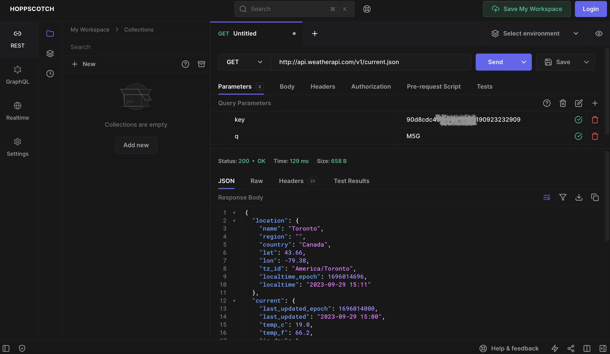
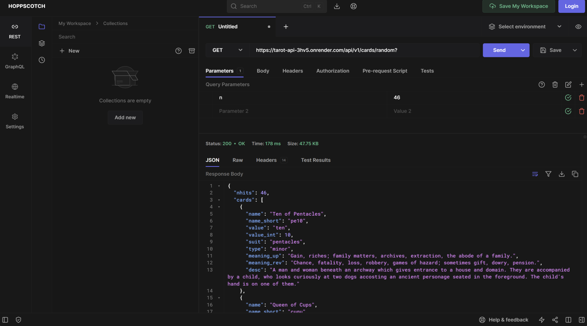
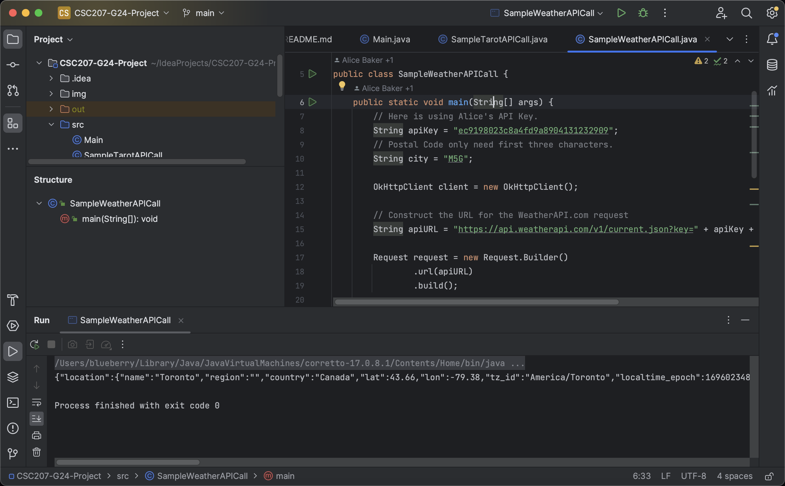

# CSC207 Group 24 Project

## Program Domain

**Weather Utility App for Personal Life**

- Create your profile with your personal data like location, preferences.

  - Locations may contain the user's home city, hometown, place travelling soon.
  
  - User preferences may contain if the user is a person like / afraid cold weathers, like / afraid warm weathers.

- Suggest user if umbrella is needed, winter coat is needed based on real-time weather conditions and user preferences.

  - Example 1: if the user says he set A/C temp at home at 16C, then he will get "Bundle Up" notification only if weather is colder than others.
 
  - Example 2: if the user is now on a business trip in Toronto, but his family is in Calgary, then he will get "Suggest your family members to wear more" if Calgary's temperature is dropping.

- **(Not Decided Yet)** Suggest user what suitable to do for today based on "Tarot/Traditional Chinese Calendar".

- **(Not Decided Yet)** Notification of special weather / natural events.

  - Example 3: Based on the user's location, if tonight got a high KP index, he might get a notification of "Possibly Aurora Appearance".

- Use of an API access to real time weather data.

- **(Not Decided Yet)** Use of an API access to Tarot Card Reading.
  

## Application Category and Description

We are focusing on developing a Weather Utility App integrated with much features that based on the user's preferences.

The user will get notified based on his preference in different weathers, temperatures, interests, and locations.

In addition, we decide to provide a feature of Tarot Cards, to suggest user what is suitable to do for today.

- The App will contain register feature.

- There will be four menus at the bottom: Weather, Calendar, Tarot, ME.

### **App Categories**

- **Personal Life**

- **Personal Care**

## API

### **Weather API**

We connected with Weather API from weatherapi.com, which is an API can help us get detailed weather conditions for both
now and future forecast. We have chose this API as it is free for us to try out first with limited information but
enough for early development.

**Weather API Documentation URL: https://www.weatherapi.com/docs/**

**Example Screenshot**

We used hoppscotch.io to tried out our API, and here is a sample GET from Weather API for location of Toronto.

### **Tarot API**

We connected with an open source Tarot database API, which contains Tarot Cards with explaination.

**Tarot API Documentation URL: https://github.com/ekelen/tarot-api**

**Example Screenshot**

We used hoppscotch.io to tried out our API, and here is a sample GET from Tarot API.

## Sample output of Java code (Test):

Here is a sample output of the Java Code when calling Weather API.

## Issues that may slow down development progress:

- APIs are no longer free or not available, that we have to switch to another source.
  
- Time needed to implement new features, and finding information for features.

- Time consuming to implement personal preferences setup.
